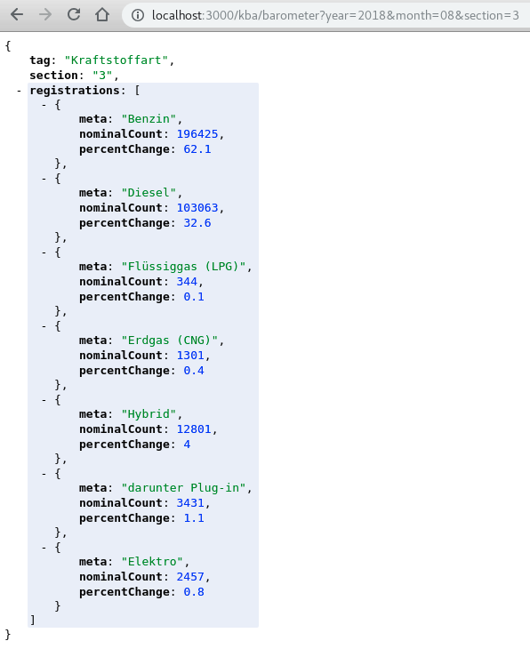

# This is *GLOB* 

## It's a scraping framework

It has a built in **plugin** for the geman KBA (Kraftfahrt - Bundesamt)  
because, why not? That is what I needed in form of structured data.  
This you can use as a template for your own plugins.

---
## Under the hood

GLOB uses `express` to provide the endpoints of the structured data  
and `cheerio` to scrape whatewer you request with the `request` module.

---
## How it works - now.

This version of the framework still reelies on your natural intelligence  
for understanding how the website you try to scrape is structured and then  
use `cheerio` to parse that structure: https://github.com/cheeriojs/cheerio  

You should encapsulate your `cheerio` logic into its own module like the  
one provided for the KBA website: **_./plugins/kba.js_**

After your module is done, expose the methods throu a new `express` endpoint.

---
## Using the framework

1. clone this project
2. run `npm install`
3. run `npm start`

---
## The near future

> **Machine learning**

---
## The far future

> **Artificial intelligence**

---
## Here is what it looks like

### Rendered Website, no public API:
 

### Machine consumable version, JSON:

